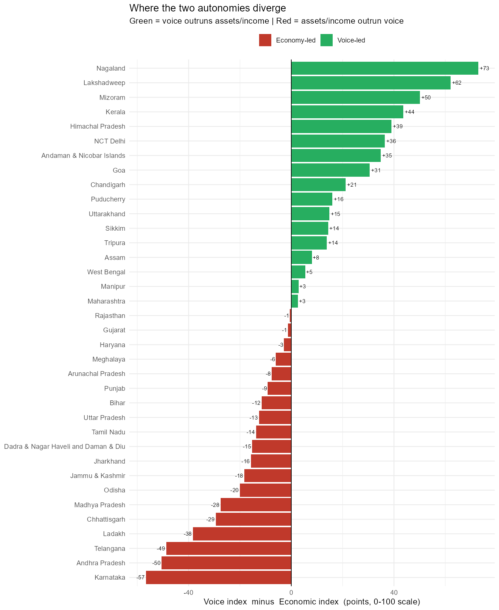

# Empowerment or Independence?
### Two kinds of women's autonomy and spousal violence across Indian states (NFHS-5)



Across India's 36 states and union territories, the indicators usually used to
show that women are "doing better" — paid work, property, bank accounts — move
*with* reported spousal violence, not against it. Indicators of voice inside the
household — participation in decisions, a phone of one's own — move the other
way.

| Index | Built from (NFHS-5 state factsheet indicators) | Pearson *r* with spousal violence | *n* |
|---|---|---|---|
| Economic Autonomy | 120 paid work, 121 owns house/land, 122 own bank account | **+0.46** (p = 0.005) | 36 |
| Voice & Decision Autonomy | 119 participates in household decisions, 123 own mobile phone | **−0.50** (p = 0.002) | 36 |

Karnataka, Telangana and Tamil Nadu sit at the top of the economic index and
near the top of the violence distribution; Nagaland, Mizoram and Lakshadweep sit
at the bottom of both the economic index and violence. The full argument is in
[`writing/draft_empowerment_or_independence.md`](writing/draft_empowerment_or_independence.md)
(working draft, not for citation). How the indices are constructed is in
[`CODEBOOK.md`](CODEBOOK.md).

## What this does and does not show

- **Correlation across 36 units.** With *n* = 36 a
  single state can move *r* by a few hundredths; the signs are stable to
  leaving any one state out, the magnitudes are not precise.
- **Ecological, not individual.** These are state averages. They say nothing
  about whether a particular woman with a bank account is more or less likely to
  experience violence.
- **"Reported" violence.** NFHS-5 indicator 125 measures violence that women
  disclosed to an interviewer. Disclosure is itself a function of voice, so
  part of the negative correlation may be measurement rather than protection.
  That possibility is part of the paper's argument and is not hidden here.
- **Index weights are equal and unvalidated.** Each index is an unweighted mean
  of min–max-scaled components. Component-level correlations with violence are
  reported in the codebook so readers can see what is driving each index
  (phone ownership dominates the voice index; land ownership dominates the
  economic index).
- **Spearman as a check.** Rank correlations are −0.56 (voice) and +0.38
  (economic). The economic relationship is weaker in ranks than in levels.

## Repository map

```
data/source/     Full NFHS-5 state factsheet indicator table as extracted (public data)
data/processed/  The six indicators used, the index scores, the gap ranking
code/            01_filter_indicators.R  ->  02_build_indices_and_figures.R
figures/         Three PNGs produced by the second script
writing/         Working draft of the essay
CODEBOOK.md      Index construction, variable definitions, component correlations
data/SOURCES.md  Where every number comes from
CITATION.cff     How to cite this repository
```

## Reproduce

From the repository root, in R (>= 4.2) with `tidyverse` and `ggrepel` installed:

```r
source("code/01_filter_indicators.R")
source("code/02_build_indices_and_figures.R")
```

The second script writes `code/sessionInfo.txt` so package versions are recorded.

## Data and licensing

Underlying data: International Institute for Population Sciences (IIPS) and ICF.
2021. *National Family Health Survey (NFHS-5), 2019–21: India* and state
factsheets. Mumbai: IIPS. All figures used here are the published state-level
percentages from the factsheets; no unit-level survey records are included.

Code is released under the MIT License (`LICENSE`). Derived tables, figures and
text are released under CC BY 4.0 (`LICENSE-DATA`). Please cite NFHS-5 as the
data source alongside this repository.

## Status

Version 0.1.0. Analysis is ongoing and the essay is a working draft. Planned:
sensitivity to alternative index weightings, and a district-level replication
where NFHS-5 district factsheets carry the same indicators.

## Author

Akash A — MA Sociology, Kolkata. akashaluni95@gmail.com
